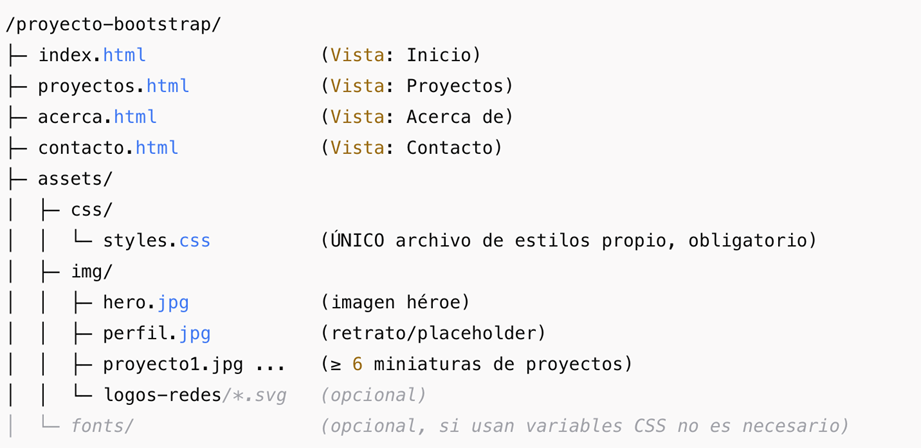

# 🌐 Práctica 1: Micrositio responsivo con Bootstrap 5

## 🎯 Objetivo
Diseñar un **micrositio multipágina** usando **Bootstrap 5**, aplicando:
- Sistema de grillas  
- Componentes clave (Navbar, Cards, Accordion, Formularios, etc.)  
- Buenas prácticas semánticas  
- Adaptación a móvil, tableta y escritorio  

---

## 📂 Estructura

---

## 📑 Páginas
- 🏠 **Inicio:** Hero + servicios en cards + alert + footer  
- 📂 **Proyectos:** Galería de ≥6 proyectos en cards + breadcrumb + footer  
- 👤 **Acerca de:** Perfil con foto + accordion + stack de tecnologías + footer  
- ✉️ **Contacto:** Formulario validado con Bootstrap + botones + footer  

---

## 📱 Responsivo
- Navbar colapsa en móvil  
- Hero en 1 columna (xs) / 2 columnas (≥992px)  
- Cards: 1 (xs), 2 (tablet), 3 (desktop)  
- Formulario en 1 columna (móvil) y 2 columnas (tablet/escritorio)  

---

## ✅ Evaluación
- ✔️ Estructura y semántica  
- ✔️ Responsividad  
- ✔️ Uso de componentes Bootstrap  
- ✔️ Diseño visual consistente  
- ✔️ Accesibilidad básica  

---

👨‍💻 **Autor:** AnthonyDev  
📅 **Año:** 2025
